# Diabetic Retinopathy Classification

Deep learning to classify retinal images into **5 severity levels** of diabetic retinopathy:  
**No DR, Mild, Moderate, Severe, Proliferative DR**.

Compares **ResNet50**, **EfficientNetB0**, **DenseNet121**, a custom CNN, and a **soft‑voting ensemble**.

## Dataset

Diabetic Retinopathy 224x224 2019 dataset (fundus images).

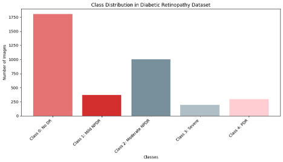

The dataset is imbalanced: “Moderate” DR has the most samples, while “Mild” and “Proliferative DR” are underrepresented. We use **class weights** during training to give higher importance to minority classes, preventing the model from ignoring them.

## Preprocessing

### Data Augmentation

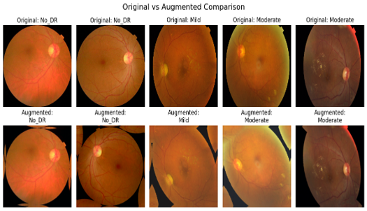

We apply random horizontal flips, rotations (±10%), zoom, and brightness/contrast adjustments. Augmentation artificially increases dataset diversity, helping the model generalize better and reducing overfitting.

### Resizing & Normalization

All images are resized to 224×224 pixels (compatible with pre‑trained models) and pixel values are scaled to the range [0,1] by dividing by 255.

## Model Architectures

### ResNet50

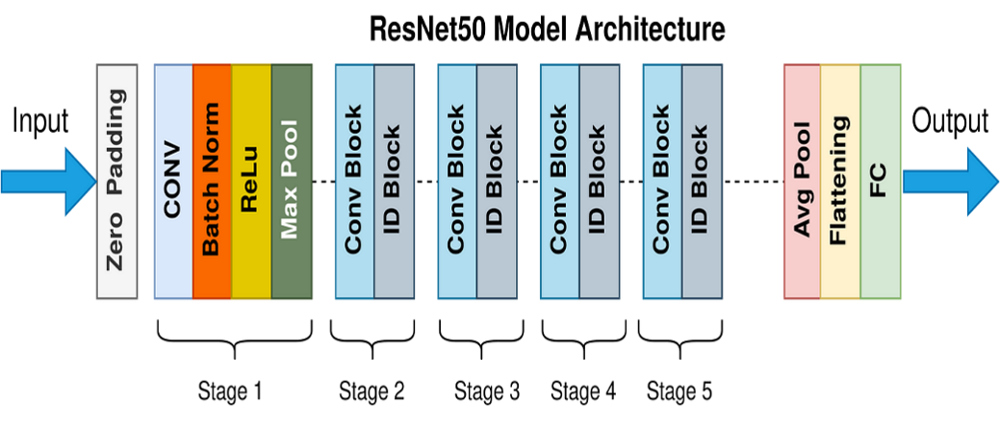

ResNet50 uses residual connections to enable very deep networks without vanishing gradients. The pre‑trained ImageNet weights are frozen, and custom classification heads are added.

### EfficientNetB0

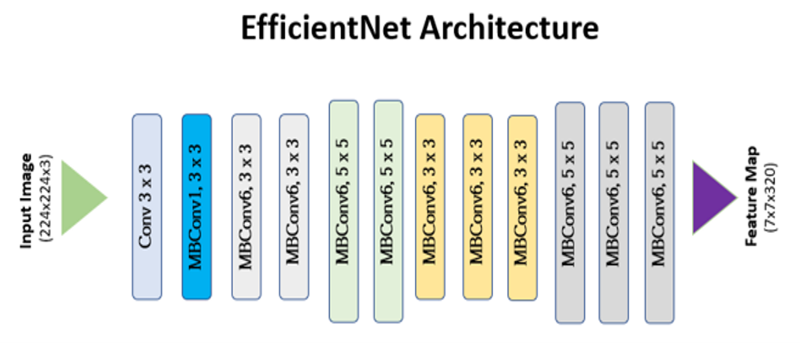

EfficientNetB0 balances depth, width, and resolution for high accuracy with fewer parameters. It is computationally efficient while maintaining strong performance.

### DenseNet121

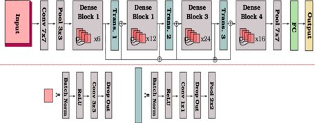

DenseNet121 connects each layer to every other layer, promoting feature reuse and strong gradient flow. This dense connectivity helps learn fine-grained retinal features.

### Ensemble (Soft Voting)

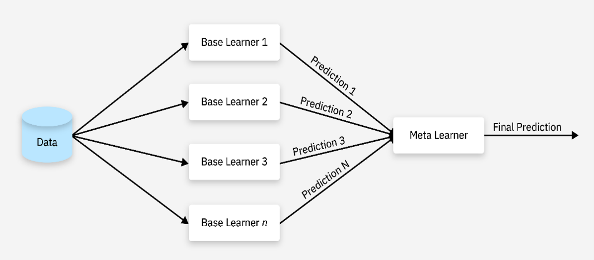

The ensemble averages predicted probabilities from all four models (ResNet50, EfficientNetB0, DenseNet121, Custom CNN). Soft voting reduces variance and improves robustness.

## Confusion Matrices

Each confusion matrix shows true labels vs predicted labels across the five DR severity classes. The diagonal represents correct classifications.

### ResNet50

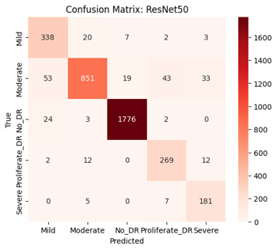

ResNet50 performs very well on **No_DR** (1776 correct) but confuses **Moderate** with **Mild** (53 cases) and **Proliferate_DR** (43 cases). Adjacent severity levels are occasionally misclassified, which is clinically acceptable as neighboring stages have similar features.

### EfficientNetB0

Slightly more confusion than ResNet50, especially **Moderate** misclassified as **Mild** (109) and **Severe** (75). Accuracy on **No_DR** remains high (1765), but intermediate classes are harder to separate.

### DenseNet121

DenseNet121 correctly classifies 1763 **No_DR** images. **Moderate** DR (753 correct) is often confused with **Mild** (92) and **Severe** (47). Overall, it balances performance across all classes better than EfficientNet.

### Custom CNN

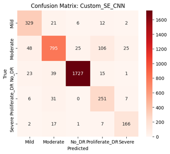

The custom model achieves 1727 correct **No_DR** predictions but struggles with **Severe** DR (only 166 correct) and often mistakes **Moderate** for **Proliferate_DR** (106 errors). This indicates the model lacks the representational power of pre‑trained networks.

### Ensemble

The ensemble achieves the best overall performance: **No_DR** (1774 correct), **Moderate** (879), **Mild** (350), **Proliferate_DR** (263), and **Severe** (180). Confusion between classes is minimal, proving that combining models reduces individual weaknesses.

## Training Curves (Accuracy & Loss)

Each plot shows training (blue) and validation (orange) accuracy/loss over epochs. Ideally, both curves should be close, indicating good generalization.

### ResNet50

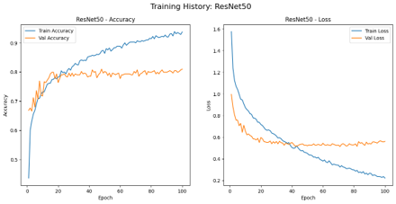

Training accuracy reaches ~90%, validation accuracy ~81%. The small gap suggests mild overfitting but acceptable generalization. Validation loss stabilizes around 0.5.

### EfficientNetB0

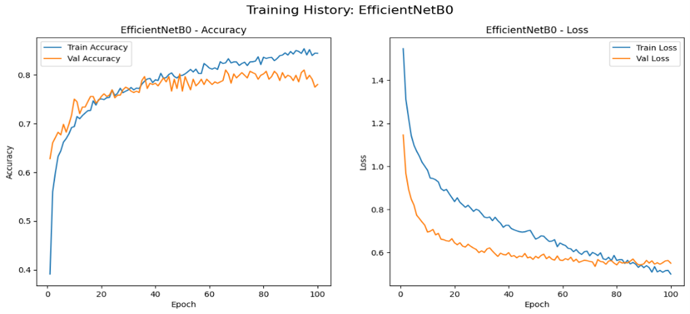

Training accuracy ~82%, validation ~75%. The 7% gap indicates underfitting or limited capacity. Loss curves show that the model could benefit from more training or fine‑tuning.

### DenseNet121

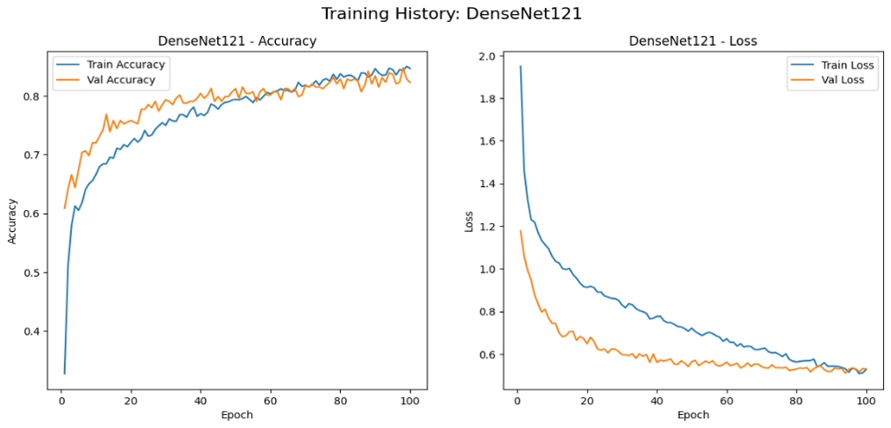

Training accuracy ~84%, validation ~80% – only a 4% gap. Loss values for both training and validation converge around 0.55, indicating excellent generalization with minimal overfitting.

### Custom CNN

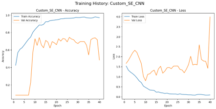

Training accuracy soars to 97%, but validation accuracy plateaus at 72% after epoch 20. The diverging loss curves (training loss near zero, validation loss high) clearly show the model is memorizing the training set. Stronger regularization or a simpler architecture is needed.

## Performance Metrics

| Model            | Val Accuracy | Precision | Recall | F1‑Score | AUC   | Loss |
|------------------|--------------|-----------|--------|----------|-------|------|
| **Ensemble**     | **94.1%**    | 0.942     | 0.938  | 0.940    | 0.993 | 0.29 |
| DenseNet121      | 83.97%       | 0.882     | 0.772  | 0.822    | 0.967 | 0.55 |
| ResNet50         | 81.0%        | 0.861     | 0.780  | 0.814    | 0.961 | 0.50 |
| EfficientNetB0   | 75.0%        | 0.833     | 0.700  | 0.761    | 0.951 | 0.53 |
| Custom CNN       | 72.83%       | 0.795     | 0.697  | 0.723    | 0.928 | 0.80 |

The **ensemble** outperforms every individual model by a large margin (94.1% accuracy, 0.993 AUC). Among single models, **DenseNet121** is the best choice (84% accuracy, high precision). **Custom CNN** lags significantly due to overfitting.

## ROC Curves (Ensemble Model)

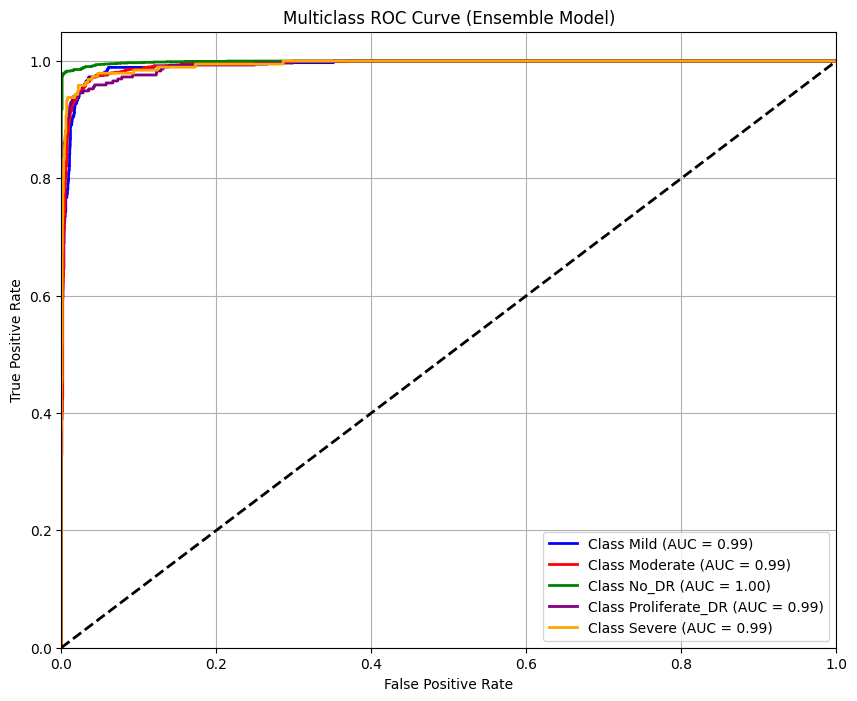

Each class has its own curve. **No_DR** achieves an almost perfect AUC of 1.00, meaning the model never confuses healthy retinas with any DR stage. **Mild**, **Moderate**, **Severe**, and **Proliferate_DR** all have AUC = 0.99, demonstrating outstanding discriminatory power across all severity levels.

## Conclusion

The **ensemble model** achieves the highest accuracy (94.1%) and near‑perfect AUC (0.993), making it suitable for clinical screening. **DenseNet121** is the best single model, offering a good trade‑off between accuracy and computational cost. The **custom CNN** suffers from overfitting, highlighting the value of transfer learning. Future work includes fine‑tuning more layers, using larger datasets, and adding explainability (e.g., heatmaps) for clinical adoption.

## References

[1] ishika Kota. (2024). Classification of Diabetic Retinopathy Using CNN. International Journal of Intelligent Systems and Applications in Engineering, 12(4), 4682–4689. Retrieved from https://www.ijisae.org/index.php/IJISAE/article/view/7165

[2] Alanazi, S., & Alanazi, R. (2025). Enhancing diabetic retinopathy detection through federated convolutional neural networks: Exploring different stages of progression. Alexandria Engineering Journal, 120, 215–228. https://doi.org/10.1016/j.aej.2025.02.026

[3] Team, K. (n.d.). Keras documentation: Learning to Resize in Computer Vision. Keras.io. https://keras.io/examples/vision/learnable_resizer/

[4] Mukherjee, S. (2022, August 18). The Annotated ResNet-50 - TDS Archive - Medium. Medium; TDS Archive. https://medium.com/data-science/the-annotated-resnet-50-a6c536034758

[5] Preeti. (2023, July 31). EfficientNet-CV - Preeti - Medium. Medium. https://medium.com/@preeti.rana.ai/efficientnet-cv-ee225feaf9af

[5] Verma, A. (2024, January 7). Unleashing the Power of Consensus: A Deep Dive into Voting Ensemble Models. Medium; Artificial Intelligence in Plain English. https://ai.plainenglish.io/unleashing-the-power-of-consensus-a-deep-dive-into-voting-ensemble-models-37096609bfe9?gi=16606b026eee

[6] Sushith, M., Sathiya, A., Kalaipoonguzhali, V., & Sathya, V. (2025). A hybrid deep learning framework for early detection of diabetic retinopathy using retinal fundus images. Scientific Reports, 15(1). https://doi.org/10.1038/s41598-025-99309-w

[7] Jabbar, A., Naseem, S., Li, J., Mahmood, T., Jabbar, K., Rehman, A., & Saba, T. (2024). Deep Transfer Learning-Based Automated Diabetic Retinopathy Detection Using Retinal Fundus Images in Remote Areas. International Journal of Computational Intelligence Systems, 17(1). https://doi.org/10.1007/s44196-024-00520-w

[8] Katarzyna Nabrdalik, Krzysztof Irlik, Meng, Y., Kwiendacz, H., Piaśnik, J., Hendel, M., Paweł Ignacy, Kulpa, J., Kegler, K., Mikołaj Herba, Boczek, S., Effendy Bin Hashim, Gao, Z., Gumprecht, J., Zheng, Y., Lip, G.Y.H. and Alam, U. (2024). Artificial intelligence-based classification of cardiac autonomic neuropathy from retinal fundus images in patients with diabetes: The Silesia Diabetes Heart Study. Cardiovascular Diabetology, 23(1). Doi: https://doi.org/10.1186/s12933-024-02367-z.

 [9] Deepchecks Community Blog. (2024, June 13). Understanding F1 Score, Accuracy, ROC-AUC & PR-AUC Metrics. Deepchecks. https://www.deepchecks.com/f1-score-accuracy-roc-auc-and-pr-auc-metrics-for-models/

‌[10] Evidently AI Team. (2024, October 1). Accuracy vs. precision vs. recall in machine learning: what’s the difference? Www.evidentlyai.com. https://www.evidentlyai.com/classification-metrics/accuracy-precision-recall

[11] Ebner, J. (2023, December 5). F1 Score, Explained - Sharp Sight. Sharp Sight. https://www.sharpsightlabs.com/blog/f1-score-explained/
